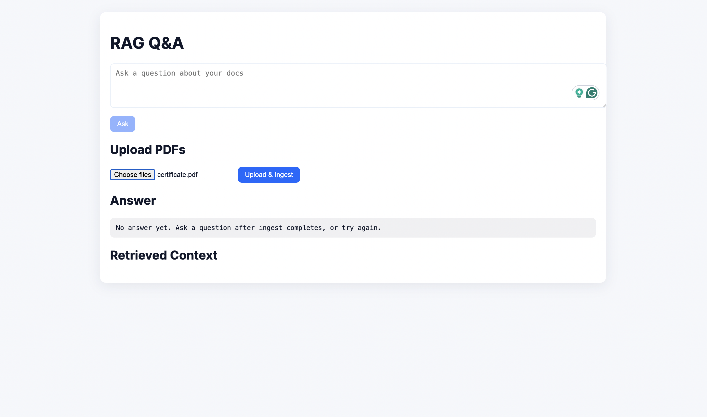
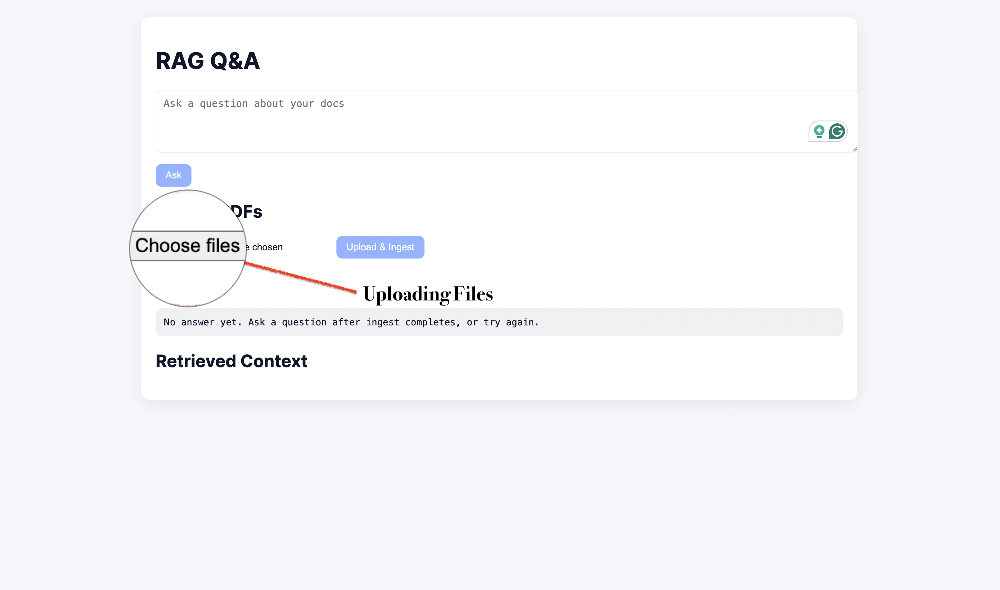
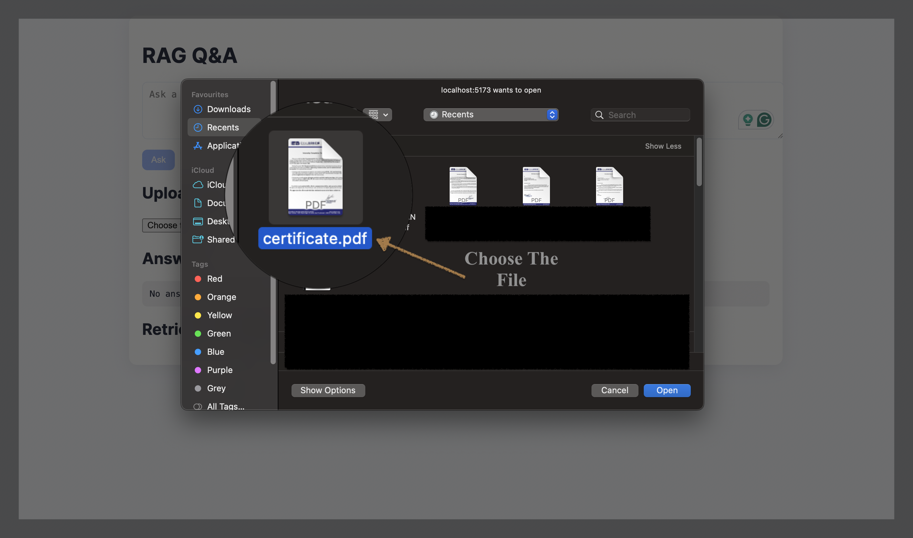
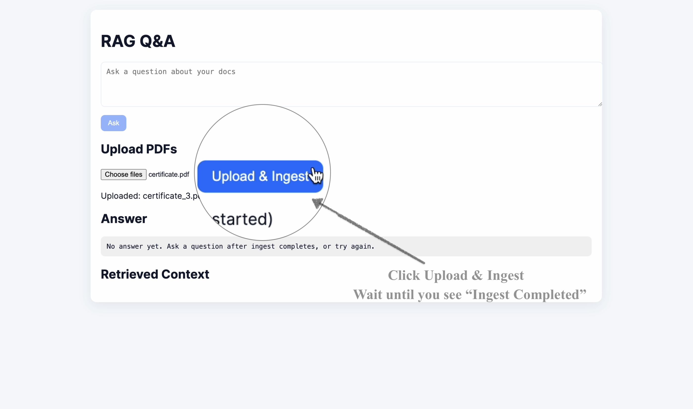
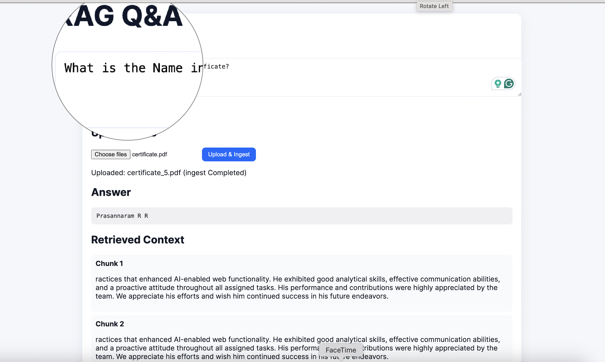
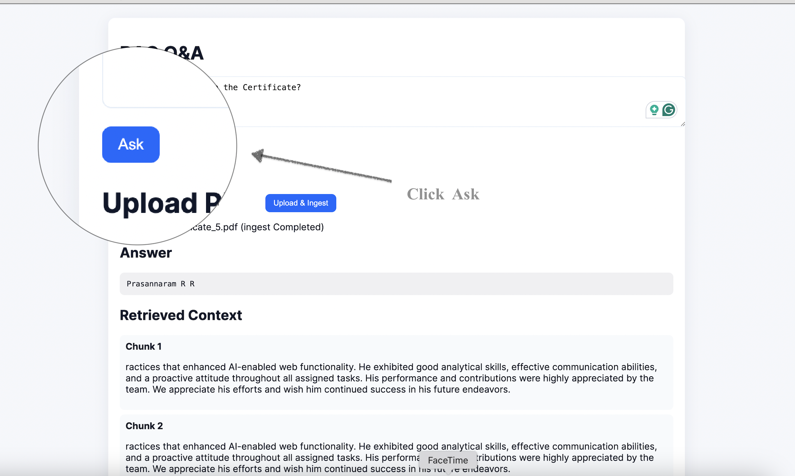
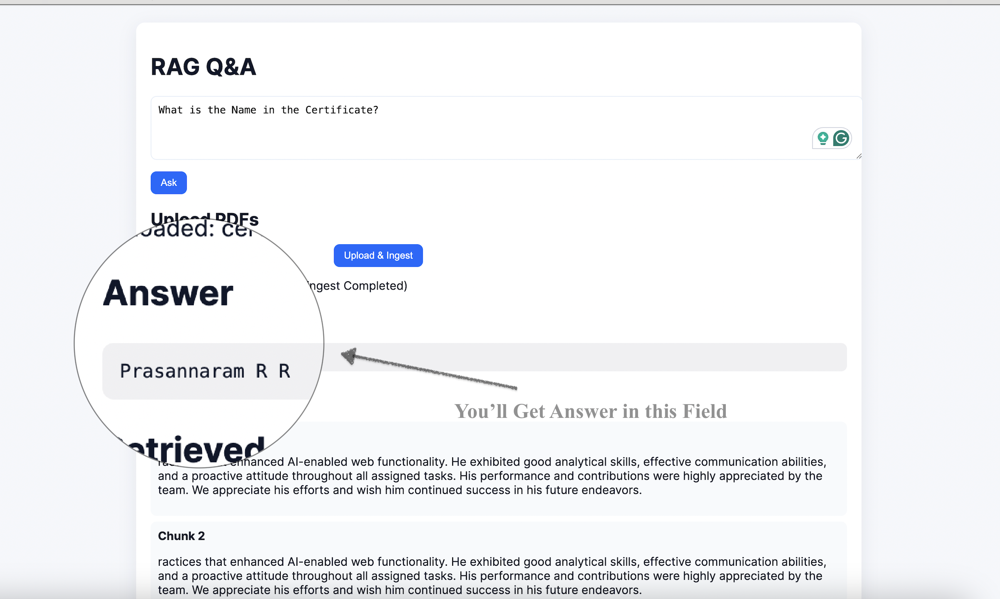
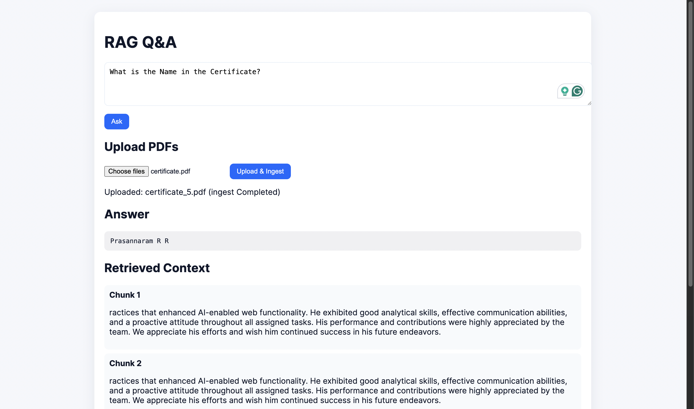

# Ragnify — AI Document Q&A System (RAG + Hugging Face + FAISS)

A clean, batteries-included RAG (Retrieval‑Augmented Generation) template:
- FastAPI backend with swappable LLM providers (Ollama, OpenAI, Anthropic, Hugging Face)
- FAISS vector index over your PDFs
- React (Vite) frontend with upload, ingest progress, and Q&A
- Streamlit minimal demo and Docker Compose for local development

“Use anything with a little tweak in code” is the idea here: swap providers via env, or extend one file to add more.

---
 
## Screenshots

Below are sequential screenshots illustrating the typical user flow: upload PDFs, ingest progress, and ask a question to retrieve an answer plus retrieved context chunks.

| Step | Preview |
|------|---------|
| 1. Initial UI |  |
| 2. Upload UI|  |
| 3. Choose File |  |
| 4. Ingest Triggered |  |
| 5. Building FAISS Index |  |
| 6. Index Ready Indicator |  |
| 7. Asking a Question |  |
| 8. Retrieval Results |  |
| Final. Answer + Context |  |

> If images fail to render on GitHub, confirm the PNG files were committed under `images/` and that case‑sensitive filenames match exactly.

## Quickstart (local dev)

Prereqs: Python 3.10+, Node 18+, macOS/Linux/WSL.

1) Create venv and install Python deps
```bash
python -m venv .venv
source .venv/bin/activate   # Windows: .venv\Scripts\activate
pip install -r requirements.txt
```

2) Set env (copy and edit as needed)
```bash
cp .env.example .env
```
- Keep API keys only in backend `.env`. Do not put secrets in `frontend/.env` (it’s shipped to the browser).

3) Start the backend (avoid --reload on low‑memory machines)
```bash
python -m uvicorn backend.app:app --host 0.0.0.0 --port 8000
```
Check: http://localhost:8000/health should return `{ "status": "ok" }`.

4) Start the frontend
```bash
cd frontend
npm install
npm run dev
```
Open the URL shown (often http://localhost:5173). Ask questions or upload PDFs.

Tip: The UI shows “backend: online/offline” and an ingest progress bar.

---

## How ingestion works (PDF → FAISS)
- Upload PDFs via the UI or put files into `data/`.
- Ingest builds `faiss_index/index.faiss` and `faiss_index/docs.pkl`.
- Progress is written to `faiss_index/status.json` and exposed at `GET /ingest_status`.
- Once `status` is `done`, queries use vector search; until then, the backend falls back to an on‑the‑fly keyword retrieval over PDFs.

Command‑line ingest (optional):
```bash
source .venv/bin/activate
python ingest_and_index.py
```

Chunking and speed knobs (env):
- `CHUNK_SIZE` (default 800) and `OVERLAP` (default 200)
- `EMBED_BATCH` (backend) / `BATCH_SIZE` (ingest script) for batching remote embeddings
- `HF_EMBED_MODEL` and `VECTOR_DIM` must match (examples below)

---

## Frontend
- Vite React app in `frontend/`
- Calls `VITE_BACKEND_URL` (default http://localhost:8000) and sends optional `VITE_API_KEY` as `X-API-KEY`
- Shows ingest progress (polls `/ingest_status`) and retrieved chunks

Development env for the frontend (optional):
```bash
cp frontend/.env.example frontend/.env
# If your backend requires an API key during dev, set VITE_API_KEY to the same value as backend API_KEY
```

Security note: Values in `frontend/.env` are bundled into the client—never put secret provider tokens there.

---

## Backend API
- `GET /health` → `{ status, index_ready, provider, emb_model, version }`
- `GET /ingest_status` → `{ status, processed_chunks, total_chunks, message }`
- `POST /upload` (multipart) → saves PDFs to `DATA_DIR` and starts ingest in background
- `POST /query` `{ question, top_k }` → `{ answer, retrieved }`

Auth: If `API_KEY` is set in backend `.env`, send `X-API-KEY: <value>` with requests (frontend does this when `VITE_API_KEY` is set).

---

## Swapping LLM providers (no code changes)
Set `LLM_PROVIDER` in backend `.env` to one of:

```
ollama | openai | anthropic | huggingface
```

And provide the matching config:

### 1) Local LLM via Ollama
- Install Ollama and pull a model:
   ```bash
   ollama pull phi3:instruct   # or llama3, mistral, etc.
   ```
- Backend `.env`:
   ```
   LLM_PROVIDER=ollama
   OLLAMA_MODEL=phi3:instruct
   ```

### 2) OpenAI
- Backend `.env`:
   ```
   LLM_PROVIDER=openai
   OPENAI_API_KEY=sk-...
   # optional model override: HF default is small; OpenAI default in code is gpt-4o-mini
   ```

### 3) Anthropic
- Backend `.env`:
   ```
   LLM_PROVIDER=anthropic
   ANTHROPIC_API_KEY=...
   # model examples: claude-3-5-sonnet, claude-3-opus
   ```

### 4) Hugging Face Inference API
- Backend `.env`:
   ```
   LLM_PROVIDER=huggingface
   HF_API_TOKEN=hf_...
   HF_MODEL=mistralai/Mistral-7B-Instruct-v0.2   # suggest small/ready models on free tier
   ```
- The backend calls the HF models endpoint with `wait_for_model=true` and gracefully falls back if generation fails (answer can be empty, but retrieved context is still returned).

Extend more providers: add a function in `backend/services/llm_providers.py` and route to it from `call_llm()`.

---

## Embeddings and FAISS
- Default is remote embeddings via HF Inference API (no heavy local model).
- Configure in backend `.env` and ingest script:
   ```
   HF_EMBED_MODEL=sentence-transformers/all-mpnet-base-v2
   VECTOR_DIM=768
   EMBED_BATCH=8  # backend batching for retrieval‑time embedding
   ```

Popular embedding choices:
- `sentence-transformers/all-mpnet-base-v2` (768d, strong semantic performance)
- `sentence-transformers/all-MiniLM-L12-v2` (384d, faster)
- `thenlper/gte-small` (384d, very fast, multilingual‑ish)

FAISS details:
- IndexFlatIP with L2‑normalized vectors → cosine similarity via dot‑product
- Files saved to `faiss_index/index.faiss` and `faiss_index/docs.pkl`

---

## Docker Compose
```bash
cp .env.example .env
docker compose up --build
```
- Frontend: http://localhost:5173
- Backend: http://localhost:8000/health
- Volumes mount `./data` and `./faiss_index` for persistence

---

## Production deployment

You can run this in production with minimal changes using Docker.

### Build images

Backend (uses `backend/Dockerfile`):
```bash
docker build -t yourrepo/rag-backend:latest ./backend
```

Frontend (uses `frontend/Dockerfile`):
```bash
docker build -t yourrepo/rag-frontend:latest ./frontend
```

Run with environment variables (never bake secrets into images):
```bash
docker run -p 8000:8000 \
   -e LLM_PROVIDER=huggingface \
   -e HF_API_TOKEN=hf_*** \
   -e HF_MODEL=mistralai/Mistral-7B-Instruct-v0.2 \
   -e HF_EMBED_MODEL=sentence-transformers/all-mpnet-base-v2 \
   -e VECTOR_DIM=768 \
   -e API_KEY=prod-secret \
   -v $(pwd)/data:/data -e DATA_DIR=/data \
   -v $(pwd)/faiss_index:/faiss_index -e INDEX_PATH=/faiss_index \
   yourrepo/rag-backend:latest
```

For the frontend, either:
- Serve the dev server in a container (current Dockerfile), or
- Build static assets (`npm run build`) and host them on a static host (Nginx, S3+CloudFront, Vercel, Netlify).

---

## AWS deployment (suggested patterns)

There are several easy paths; pick one based on your team and budget.

### Option A: ECS Fargate + ECR + ALB (no servers to manage)
- Push images to Amazon ECR.
- Create an ECS service (Fargate) for the backend.
   - Configure environment via AWS Secrets Manager/Parameter Store (HF_API_TOKEN, API_KEY, etc.).
   - Mount an EFS volume to persist `faiss_index/` and `data/` across task restarts.
   - Put the service behind an Application Load Balancer (ALB). Set CORS to your frontend domain.
- Frontend: build static assets and host on S3 + CloudFront (recommended) or run a tiny Nginx container on ECS.

Reference commands:
```bash
# Authenticate Docker to ECR
aws ecr get-login-password | docker login --username AWS --password-stdin <acct>.dkr.ecr.<region>.amazonaws.com

# Tag and push
docker tag yourrepo/rag-backend:latest <acct>.dkr.ecr.<region>.amazonaws.com/rag-backend:latest
docker push <acct>.dkr.ecr.<region>.amazonaws.com/rag-backend:latest
```

### Option B: EC2 or Lightsail (quick DIY)
- Launch a small VM, install Docker, run the two containers, and point a domain at it.
- Use systemd or a compose stack + `docker compose up -d`.

### Option C: EKS or serverless APIs
- EKS (Kubernetes) for larger teams.
- API Gateway + Lambda for a serverless control plane (note: embedding batching and FAISS persistence need redesign for Lambda; recommend a managed vector DB).

Secrets on AWS:
- Use AWS Secrets Manager or SSM Parameter Store for `HF_API_TOKEN`, `OPENAI_API_KEY`, etc.
- Never store provider tokens in the frontend.

Storage on AWS:
- EFS for shared `faiss_index/` and `data/` between replicas
- S3 for original PDFs (then ingest them into your vector store)

---

## Database and vector store options

This starter uses FAISS on local disk by default. To scale or run multiple replicas, swap FAISS for a database/vector store with minor code changes.

Options:
- PostgreSQL + pgvector (simple, robust, great if you already use Postgres)
- Qdrant (open‑source, easy to self‑host; also a managed cloud)
- Weaviate (open‑source + cloud)
- Milvus (high‑throughput)
- Pinecone (managed, hands‑off)

What changes in code?
- Centralize vector store calls in the retrieval section of `backend/app.py` (FAISS search) and/or add a `services/vector_store.py` abstraction.
- Replace FAISS add/search with your DB client’s upsert/query.
- Replace `docs.pkl` with a documents table/collection (id, text, source, metadata, embedding).

Schema sketch (pgvector example):
```sql
CREATE TABLE documents (
   id SERIAL PRIMARY KEY,
   source TEXT,
   chunk TEXT,
   embedding VECTOR(768),
   created_at TIMESTAMPTZ DEFAULT now()
);
-- Index for nearest‑neighbor search
CREATE INDEX ON documents USING ivfflat (embedding vector_cosine_ops) WITH (lists = 100);
```

Then query with `ORDER BY embedding <-> :query_vector LIMIT :k`.

Minimal tweak philosophy:
- Providers: switch with `LLM_PROVIDER`
- Models: set via env (`HF_MODEL`, `OLLAMA_MODEL`, etc.)
- Vector store: swap FAISS calls for DB client calls in one place

---

## Troubleshooting
- Backend keeps dying with code 137: don’t use `--reload` on low‑memory machines; run plain `uvicorn`.
- “Network error: Failed to fetch” in the UI: backend isn’t reachable or CORS. Backend allows any localhost port via CORS regex; ensure it’s running on 8000.
- 401 Unauthorized from `/query`: set matching `API_KEY` (backend) and `VITE_API_KEY` (frontend) or disable the key in dev.
- Empty `answer` but retrieved chunks show: your generation provider may be unconfigured (e.g., missing `HF_API_TOKEN`). Configure provider env or switch provider.
- Slow ingest: increase `CHUNK_SIZE` (e.g., 1000), reduce `OVERLAP`, raise batching (e.g., `EMBED_BATCH=8`) and prefer faster embed models.

---

## Project structure
```
backend/
   app.py                  # FastAPI app
   services/
      llm_providers.py     # Provider adapters (Ollama/OpenAI/Anthropic/HF)
      embeddings.py        # HF embeddings client
frontend/
   src/App.jsx            # UI (upload, progress, Q&A)
   src/styles.css         # Minimal styles
ingest_and_index.py      # PDF → chunks → embeddings → FAISS index
faiss_index/             # index.faiss, docs.pkl, status.json
data/                    # your PDFs
```

---

## Notes & safety
- Do not commit real tokens. `.env`, `backend/.env`, and `frontend/.env` are git‑ignored (keep `.env.example` tracked).
- Frontend `.env` is public; never put provider secrets in it.
- The backend degrades gracefully: if embeddings or generation are unavailable, it falls back to keyword retrieval or extractive snippets.

---

## Streamlit minimal demo (optional)
```bash
streamlit run app_streamlit.py
```
This uses a local sentence‑transformers model (if installed) and the existing FAISS index for a quick prototype.


